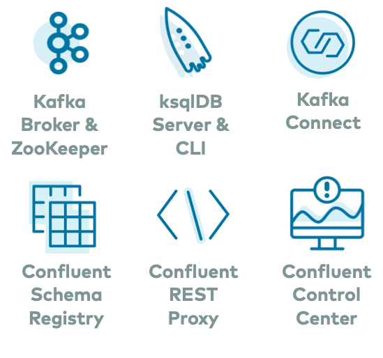

# Confluent Platform All-In-One example

This docker-compose project and README text is extracted from (https://github.com/confluentinc/cp-all-in-one). When used with the consul-registrator project, the Confluent control center is accessible at http://cp-enterprise-control-center.service.docker:9021.

_NOTE_ The system running Docker must be allocated >= 8GB of memory for this project.

This [docker-compose.yml](docker-compose.yml) launches all services in Confluent Platform and runs them in containers in your local host, enabling you to build your own development environments.

For an example of how to use this Docker setup, refer to the [Confluent Platform quickstart](https://docs.confluent.io/current/quickstart/index.html?utm_source=github&utm_medium=demo&utm_campaign=ch.cp-all-in-one_type.community_content.cp-all-in-one)

To see this `cp-all-in-one` example in action, see the automated demos in https://github.com/confluentinc/examples/tree/latest/cp-quickstart.

# Additional Examples

For additional examples that showcase streaming applications within an event streaming platform, please refer to [these demos](https://github.com/confluentinc/examples).

# Additional Resources

- [Generate test data](https://www.confluent.io/blog/easy-ways-generate-test-data-kafka?utm_source=github&utm_medium=demo&utm_campaign=ch.cp-all-in-one_type.community_content.top): "Hello, World!" for launching Confluent Platform, plus different ways to generate more interesting test data for your topics
- [Confluent Documentation](https://docs.confluent.io/current/getting-started.html?utm_source=github&utm_medium=demo&utm_campaign=ch.cp-all-in-one_type.community_content.top)
- [confluentinc/examples](https://github.com/confluentinc/examples): curated list of end-to-end demos that showcase Apache Kafka® event stream processing on the Confluent Platform, an event stream processing platform that enables you to process, organize, and manage massive amounts of streaming data across cloud, on-prem, and serverless deployments.
